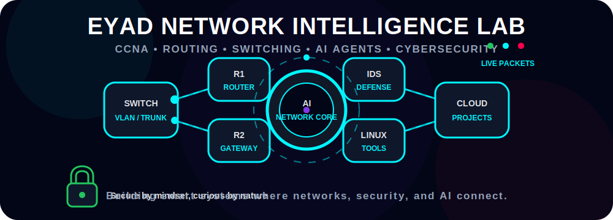

⸻

  

⸻

🚀 About Me

I’m Eyad Amir Sultan, a technology student from Egypt focused on Computer Networks, AI tools, Cybersecurity, Automation, and Web Development.

I like building real projects, testing new ideas, and turning simple concepts into useful systems. My goal is to grow as a developer and security-minded engineer who can build tools that solve real problems.

* 🎓 Technology / Networks Student
* 🌐 Learning CCNA, Routing, Switching, VLANs, and Network Security
* 🤖 Building and exploring AI agents, local AI, and smart assistants
* 💻 Working with Python, Web Development, Linux, and Automation
* 🔐 Interested in Ethical Cybersecurity and Defensive Testing
* 🚀 Always improving through real projects

⸻

🧠 Tech Stack

⸻

⚡ Current Focus

<table>
<tr>
<td><b>AI Assistants</b></td>
<td>███████████░░░</td>
<td>Learning & Building</td>
</tr>
<tr>
<td><b>Computer Networks</b></td>
<td>████████████░░</td>
<td>CCNA / Switching / Routing</td>
</tr>
<tr>
<td><b>Cybersecurity</b></td>
<td>█████████░░░░░</td>
<td>Ethical Testing & Defense</td>
</tr>
<tr>
<td><b>Web Development</b></td>
<td>██████████░░░░</td>
<td>WordPress / HTML / CSS / JS</td>
</tr>
<tr>
<td><b>Automation</b></td>
<td>█████████░░░░░</td>
<td>Scripts & AI Workflows</td>
</tr>
</table>

⸻

🛠️ Interests

<table>
<tr>
<td width="50%">

🌐 Networking

* CCNA concepts
* VLAN / InterVLAN Routing
* Switching & Routing
* Network troubleshooting
* Secure network design

</td>
<td width="50%">

🤖 AI & Automation

* AI agents
* Local AI models
* Smart assistants
* Workflow automation
* Python scripting

</td>
</tr>
<tr>
<td width="50%">

🔐 Cybersecurity

* Ethical security testing
* Vulnerability research basics
* Web security awareness
* Linux security tools
* Defensive mindset

</td>
<td width="50%">

💻 Development

* Frontend basics
* WordPress websites
* Backend fundamentals
* Database basics
* Real project building

</td>
</tr>
</table>

⸻

📊 GitHub Stats

⸻

🧩 My Mindset

I don’t just want to learn technology — I want to build things that people remember.

I believe the best way to improve is by building, testing, breaking, fixing, and repeating. Every project is a step toward becoming better.

⸻

📫 Connect With Me

⸻

⭐ Thanks for visiting my profile

